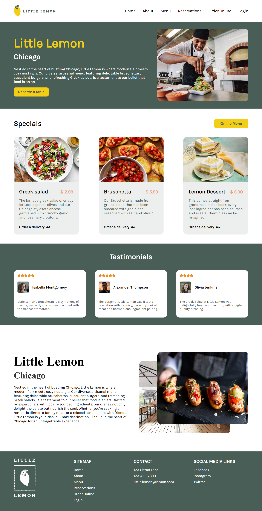

# Little Lemon Restaurant Booking 

Welcome to Little Lemon Restaurant's reservation booking website.

## Features

- restaurant information, special menu and testimonials
- view available reservation schedule for a chosen date and party size
- make a reservation by selecting a desired time slot and entering contact information
- responsive design for optimal viewing on various devices

## Available Scripts

In the project directory, you can run:

### `npm i`
The npm install command is used to install all the dependencies defined in your project's package.json file. 

### `npm start` / `npm run dev`

Runs the app in development mode.\
Open [http://localhost:3000](http://localhost:3000) to view it in your browser.

### `npm test`
Launches the test runner in the interactive watch mode.
It runs all the tests for the application and provides feedback on their status.

The test files are typically located in a directory named __tests__ or have a .test.js or .spec.js extension.

Make sure to write comprehensive tests to ensure the stability and correctness of the application.
